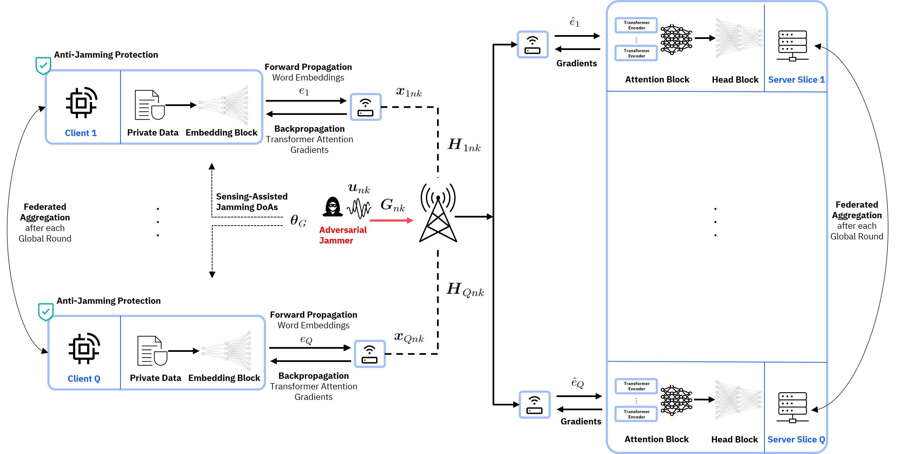

<div align="center">

# PHY Matters: On the Connection between Resilient Physical Layer Design and Split Federated Learning

[](https://www.nature.com/articles/nature14539)
[](https://papers.nips.cc/paper/2020)

</div>

## Abstract
<div align="justify">
In this work, the design and implementation of sensing-assisted, resilient-by-design anti-jamming strategies for Split Federated Learning (SFL) over multi-user MIMO-OFDM wireless channels is investigated for the particular case of distributed Large Language Model (LLM) training. In the considered Split FL system, sensitive word embeddings are transmitted over the wireless channel to a corresponding server instance, which continues training the remaining split of the LLM. In this setup, an adversarial jammer employs the worst-case jamming strategy, aiming to impair the global model learning performance by minimizing the sum-rate of the legitimate transmitters, thereby jamming the word embeddings in the uplink. At the same time, detailed information about the jamming directions-of-arrival (DoAs) is available at the clients, for example, as part of future 6G wireless sensing services. In order to prevent the server from processing corrupted word embeddings, which may deteriorate the model performance and distort the semantic understanding of the input data, the additional information on the DoAs can be utilized to devise an effective anti-jamming strategy. To this end, it is first shown that the resulting model error is directly dependent on the communication MSE by investigating a relaxed (L_0, L_1)-smoothness assumption on the Transformer-based model loss function. Subsequently, the resilient-by-design anti-jamming strategy is formulated as a joint optimization problem with side constraints on beamforming, user scheduling and resource allocation, aiming to maximize the transmitter-side sum-rate. In a novel approach, precise knowledge about the jamming covariance is substituted with a surrogate expression, which approximates the jamming statistics by incorporating only the jamming DoAs. Numerical results on fine-tuning two natural language processing (NLP) tasks using BERT and RoBERTa base models eventually validate the theoretical analysis and demonstrate the effectiveness of the proposed resilient-by-design wireless Split FL protocol against adversarial worst-case jamming.
</div>

## Description

We study the influence of communication MSE in a MIMO-OFDM system on the model performance a split-federated learning setup under worst-case adversarial attacks.

<div align="center">


</div>

## How to run

Install dependencies

```bash
# clone project
git clone https://gitlab.lrz.de/aces/6g-life/resilience/resilient_sfl.git
cd resilient_sfl

# install resilient_comms and isac (contact vlad.andrei@tum.de, aladin.djuhera@tum.de for permissions)
pip install git+https://gitlab.lrz.de/aces/6g-life/resilience/resilient_comms.git
pip install git+https://gitlab.lrz.de/aces/6g-life/integrated_sensing_and_communication.git

# install requirements
pip install -r requirements.txt
```

Run SFL training with default configurations

```bash
# train on CPU
python src/run.py trainer=cpu

# train on GPU
python src/run.py trainer=gpu
```

Run SFL training with chosen experiment configuration from [configs/experiment/](configs/experiment/)

```bash
python src/run.py experiment=experiment_name.yaml
```

You can override any parameter from the command line like this

```bash
python src/run.py trainer.max_epochs=20 datamodule.batch_size=64
```
