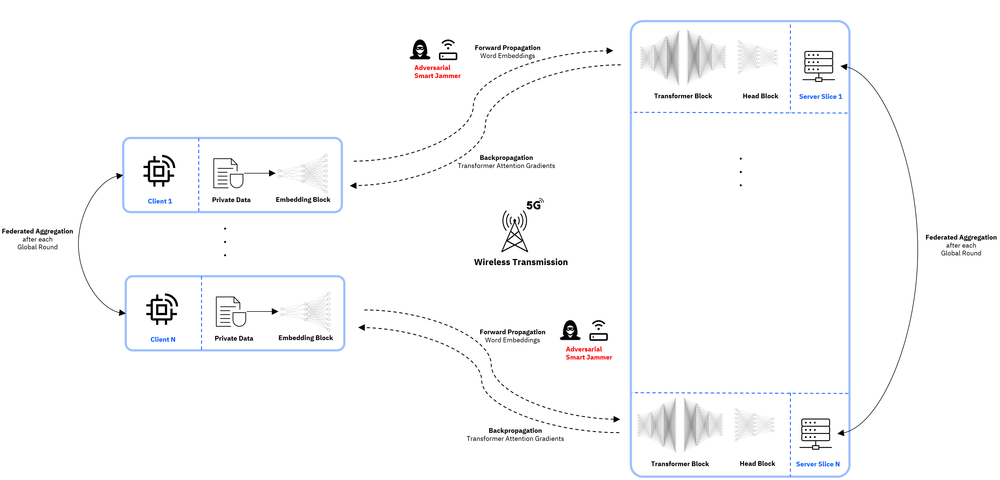

<div align="center">

# PHY Matters: On the Connection between Resilient Physical Layer Design and Split Federated Learning

[](https://www.nature.com/articles/nature14539)
[](https://papers.nips.cc/paper/2020)

</div>

## Description

We study the influence of communication MSE in a MIMO-OFDM system on the model performance a split-federated learning setup under worst-case adversarial attacks.

<div align="center">


</div>

## How to run

Install dependencies

```bash
# clone project
git clone https://gitlab.lrz.de/aces/6g-life/resilience/resilient_sfl.git
cd resilient-sfl

# [OPTIONAL] create conda environment
conda create -n sfl python=3.10
conda activate sfl

# install pytorch according to instructions
# https://pytorch.org/get-started/

# install resilient_comms and isac (contact vlad.andrei@tum.de for permissions)
pip install git+https://gitlab.lrz.de/aces/6g-life/resilience/resilient_comms.git
pip install git+https://gitlab.lrz.de/aces/6g-life/integrated_sensing_and_communication.git

# install requirements
pip install -r requirements.txt
```

Train model with default configuration

```bash
# train on CPU
python src/train.py trainer=cpu

# train on GPU
python src/train.py trainer=gpu
```

Train model with chosen experiment configuration from [configs/experiment/](configs/experiment/)

```bash
python src/train.py experiment=experiment_name.yaml
```

You can override any parameter from command line like this

```bash
python src/train.py trainer.max_epochs=20 datamodule.batch_size=64
```
